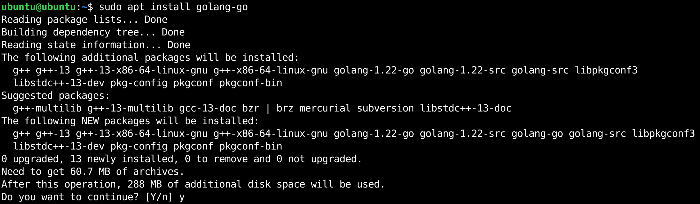

# Create A Kubernetes Cluster Playground


[kind](https://sigs.k8s.io/kind) is a tool for running local Kubernetes clusters using Docker container “nodes”.
kind was primarily designed for testing Kubernetes itself, but may be used for local development or CI.

Create a new virtual machine with the following settings:

- 4 vCPUs
- 8 GB RAM
- One 20 GB HDD

The following demonstration is performed on Ubuntu Linux 24.04 LTS. If you are using RHEL, AlmaLinux, or Rocky Linux, modifications to the golang installation command is necessary.

https://github.com/sait-lab/kind/assets/81775267/cca2d49d-6c72-45f5-90ae-704bef11e065

### Section A: Install kind

1. Go is an open-source programming language supported by Google. Go is widely used in the DevOps and Cloud Native space.

   Install Go on Ubuntu Linux:

   ```
   sudo apt install golang-go
   ```

      Install Go on RHEL/AlmaLinux/Rocky Linux:

   ```
   sudo dnf install golang
   ```

    

2. Install `kind` using `go`
   ```
   cd ~
   go install sigs.k8s.io/kind@v0.23.0
   ```

    

3. Create a symbolic link of `kind` binary
   ```
   sudo ln -s ~/go/bin/kind /usr/local/bin
   ```

4. Verify that `kind` has been successfully installed
   ```
   kind --help
   ```

    


### Section B: Create a k8s cluster using kind

To use kind, you will also need to [install docker on Ubuntu](https://docs.docker.com/engine/install/ubuntu/) or [install docker on RHEL](https://docs.docker.com/engine/install/rhel/). If you don't want to preface the `docker` command with `sudo`, [Docker Post-installation steps](https://docs.docker.com/engine/install/linux-postinstall/).

1. Verify that `docker` is installed and working correctly.
   ```
   $ sudo docker run hello-world
   
   Unable to find image 'hello-world:latest' locally
   latest: Pulling from library/hello-world
   c1ec31eb5944: Pull complete
   Digest: sha256:266b191e926f65542fa8daaec01a192c4d292bff79426f47300a046e1bc576fd
   Status: Downloaded newer image for hello-world:latest
   
   Hello from Docker!
   This message shows that your installation appears to be working correctly.
   
   ......
   redacted for brevity
   ```

2. Download kind example config file [kind-example-config](https://raw.githubusercontent.com/kubernetes-sigs/kind/main/site/content/docs/user/kind-example-config.yaml).
   ```
   wget https://raw.githubusercontent.com/kubernetes-sigs/kind/main/site/content/docs/user/kind-example-config.yaml
   ```

   If you are running Docker without the Docker Desktop Application on Linux, you can simply send traffic to the node IPs from the host without extra port mappings. With the installation of the Docker Desktop Application, whether it is on macOs, Windows or Linux, you will want to modify the `kind-example-config.yaml` to use [Extra Port Mappings](https://kind.sigs.k8s.io/docs/user/configuration/#extra-port-mappings).

3. [Configuring Your kind Cluster](https://kind.sigs.k8s.io/docs/user/quick-start/#configuring-your-kind-cluster)

   ```
   kind create cluster --config kind-example-config.yaml
   ```

    

4. The Kubernetes command-line tool, [kubectl](https://kubernetes.io/docs/reference/kubectl/kubectl/), allows you to run commands against Kubernetes clusters. You can use kubectl to deploy applications, inspect and manage cluster resources, and view logs.

   [Install and Set Up `kubectl` on Linux](https://kubernetes.io/docs/tasks/tools/install-kubectl-linux/)

   ```
   curl -LO "https://dl.k8s.io/release/$(curl -L -s https://dl.k8s.io/release/stable.txt)/bin/linux/amd64/kubectl"
   
   chmod +x ./kubectl
   
   sudo mv ./kubectl /usr/local/bin/kubectl
   ```

5. This step is optional. Depending on your shell, append `alias k=kubectl` to your `~/.bashrc` or `~/.zshrc` file. It spares you from typing `kubectl` over and over.

6. Execute `kubectl get nodes`. If you see the following output, congratulations!
   ```
   $ kubectl get nodes
   NAME                 STATUS   ROLES           AGE     VERSION
   kind-control-plane   Ready    control-plane   5m33s   v1.30.0
   kind-worker          Ready    <none>          5m10s   v1.30.0
   kind-worker2         Ready    <none>          5m12s   v1.30.0
   kind-worker3         Ready    <none>          5m11s   v1.30.0
   ```

